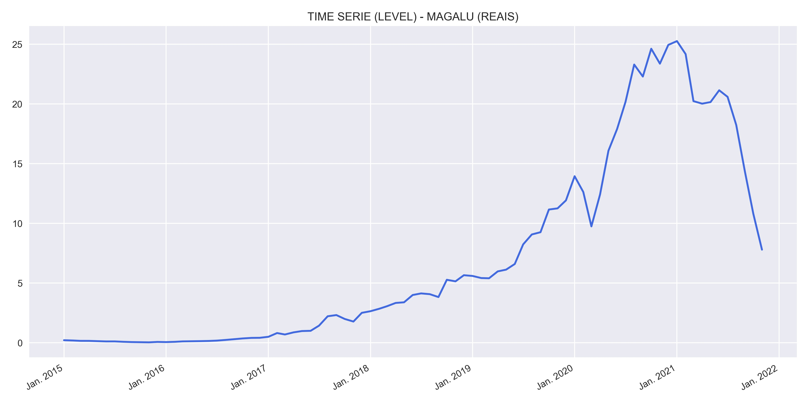
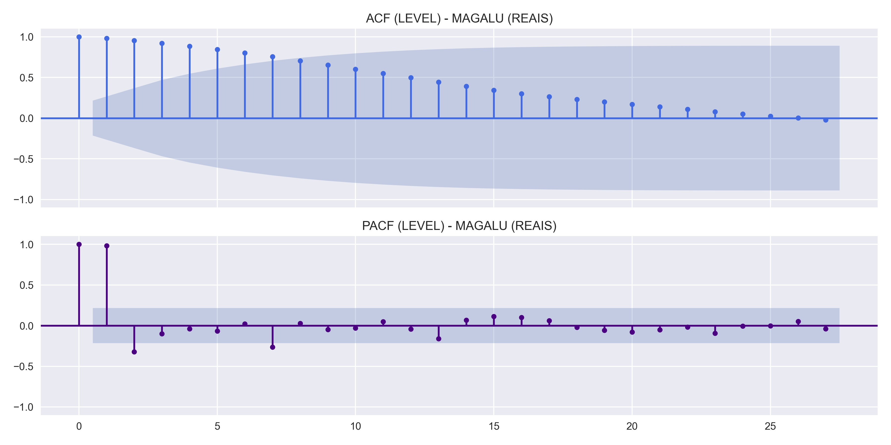
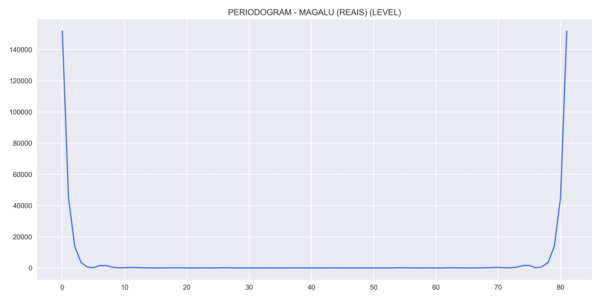
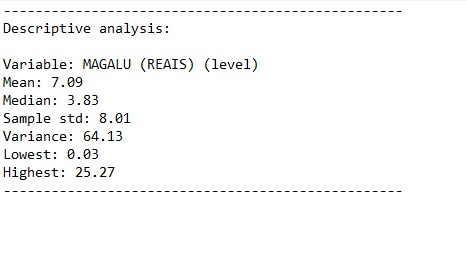
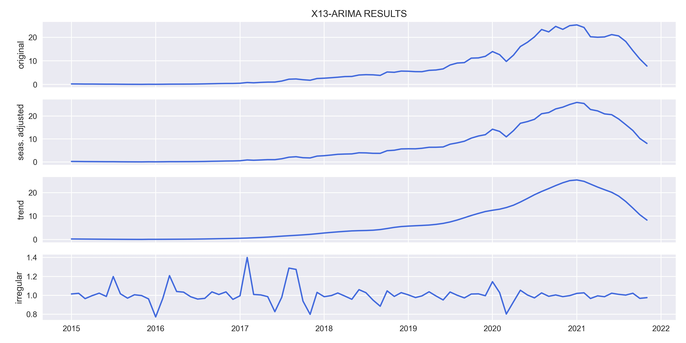
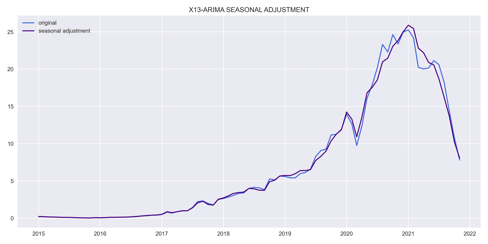
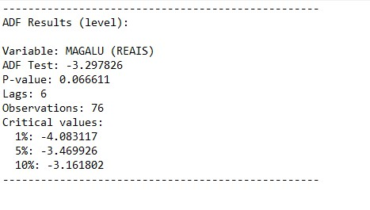
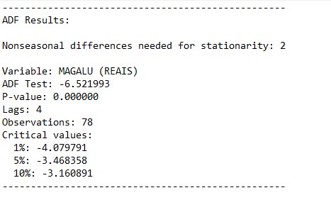
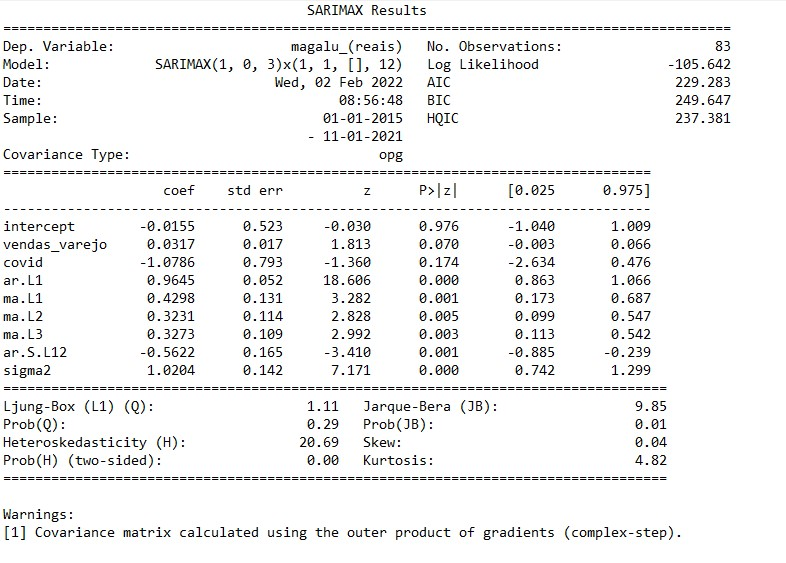
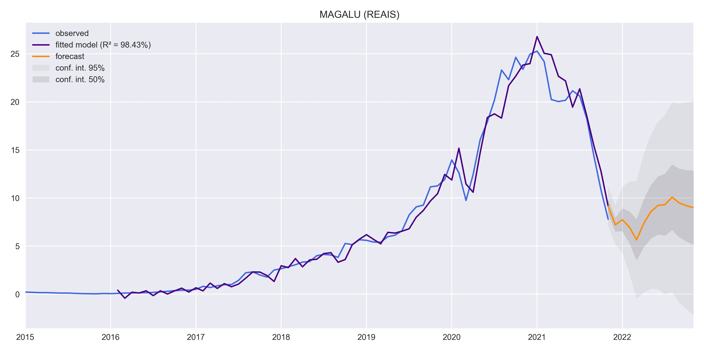

# **DESCRIPTION**

## Study of Magazine Luiza stock price using time series and also the oscillation of the nominal retail sales index as an exogenous variable. In order to forecast the stock price, it was first necessary to make a forecast, also using time series, for the nominal retail sales index.

Model results for predicting the nominal retail sales index: https://github.com/juliokozarewicz/nominal_retail_sales

>This is not a buy or sell recommendation, it is just a study and should not be considered when making an investment decision!

## Nominal retail sales
For nominal sales, the gross resale revenue, total and per Federation Unit, is considered, defined within the company as the monthly gross revenue from the resale of goods, not deducting applicable taxes or canceled sales, rebates and taxes unconditional, also not considering in its calculation the relative prices of the IPCA or any type of deflation. For extended retail trade, it is considered commercial units that resell new and used goods, without transformation, both to companies and to the general public, whether for consumption or personal or domestic use. Traditional commerce is included in stores open to the public as well as retailing through non-traditional means, such as catalogue, door-to-door, television, internet and others. Base is the value, at a given moment (effective or resulting from the average taken within a time interval) that serves as a term of comparison, when one wants to calculate a succession of index numbers.

## MAGALU
Magazine Luiza or Magalu, is a multichannel Brazilian retail digital platform. It was founded in 1957 in the city of Franca by the couple Luiza Trajano Donato and her husband Pelegrino José Donato. It has more than 1110 physical stores, is present in 23 states and 819 municipalities in the country and its business model today is characterized as a digital platform with physical points. Its e-commerce operation won the Diamond trophy 12 times in the Excellence in Quality Electronic Commerce Award – B2C. Since January 2016, its president (CEO) is Frederico Trajano, son of Luiza Helena Trajano, niece of the company's founder, Luiza Trajano Donato. His management was responsible for the company's digital transformation. In 2017, the company had its best result so far, with a net profit of R$389 million, an increase of 300% compared to the previous year. That year, its sales totaled R$ 14.4 billion.
In December 2018, Magazine Luiza won the Caboré award, considered the highest award in Brazilian advertising, in the Advertiser category and in 2021 it took the Bronze Lion in Cannes in the Creative E-commerce category with the action "Magalu + Deezer - Shopping Insinde Songs". According to a survey by the Boston Consulting Group (BCG), based on data from December 31, 2020, in the period from 2016 to 2020, Magazine Luiza generated a total return of 226.4% of gains in market valuation and dividends annual earnings, placing Magalu as the company that most generated shareholder returns in the world, ranking first in the global ranking by industry.

Data source: Yahoo finance.

# **RESULTS**
Results obtained through the model estimation process.

## Variable analysis at level:
    
    
    
    

## SEASONAL ADJUSTMENT:
    
    

## Study of data stationarity:
    
    

## Model results:
    

## Residual analysis:
    
    
    

# FORECAST:
    
